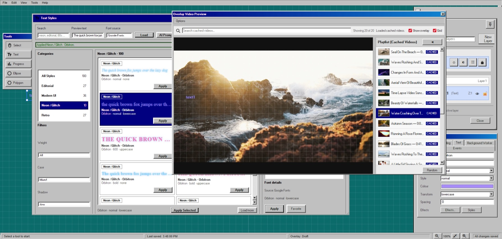
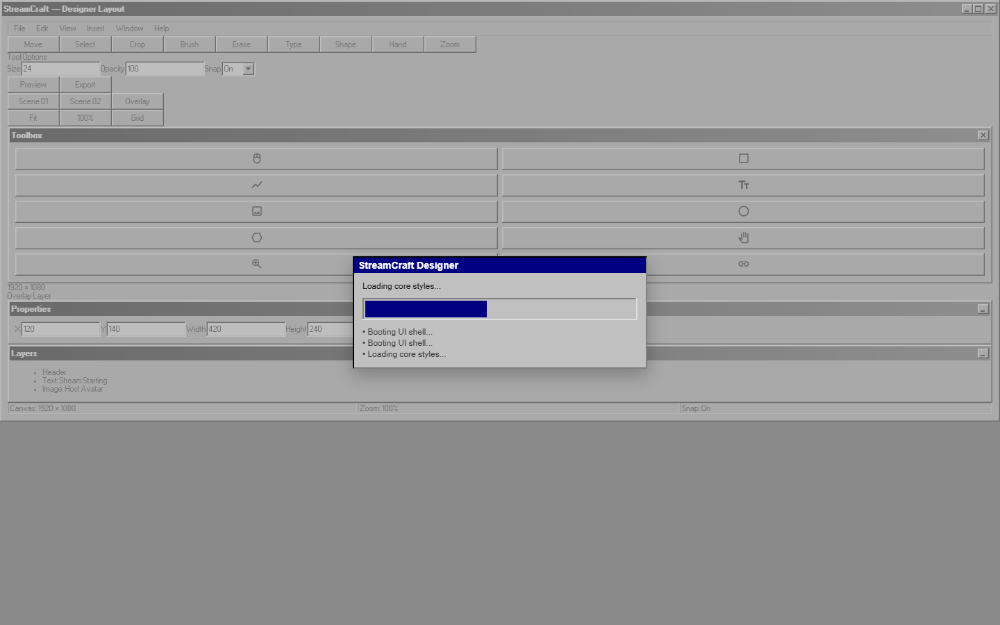
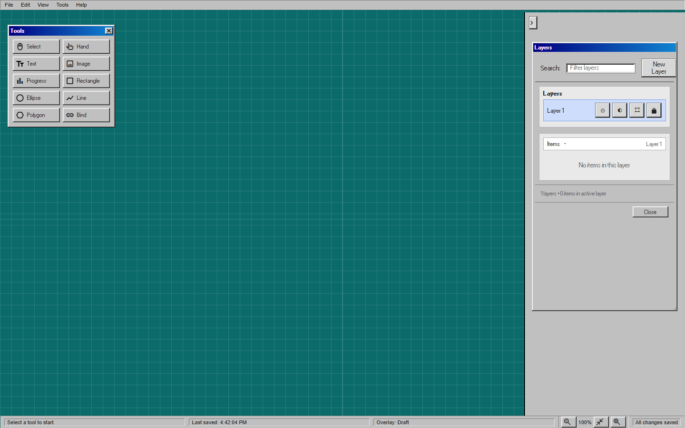
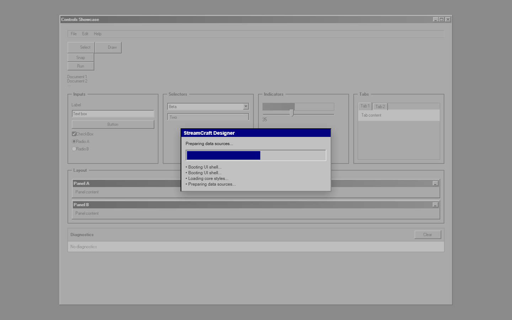
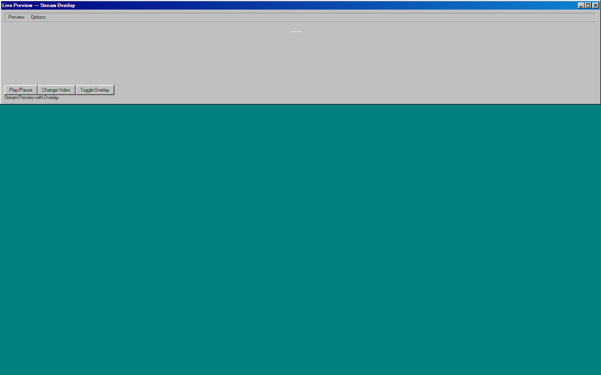
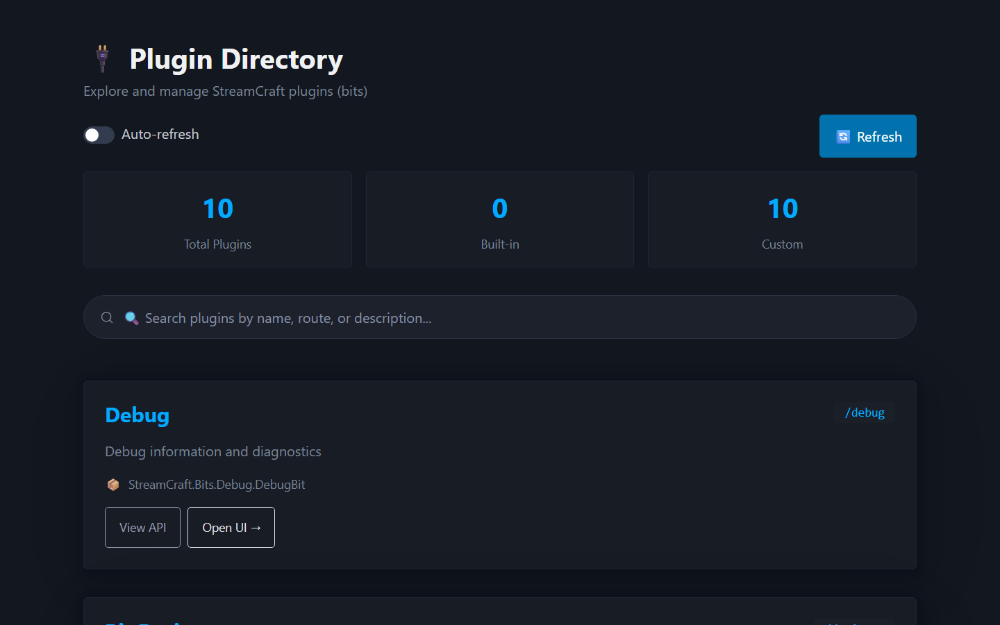
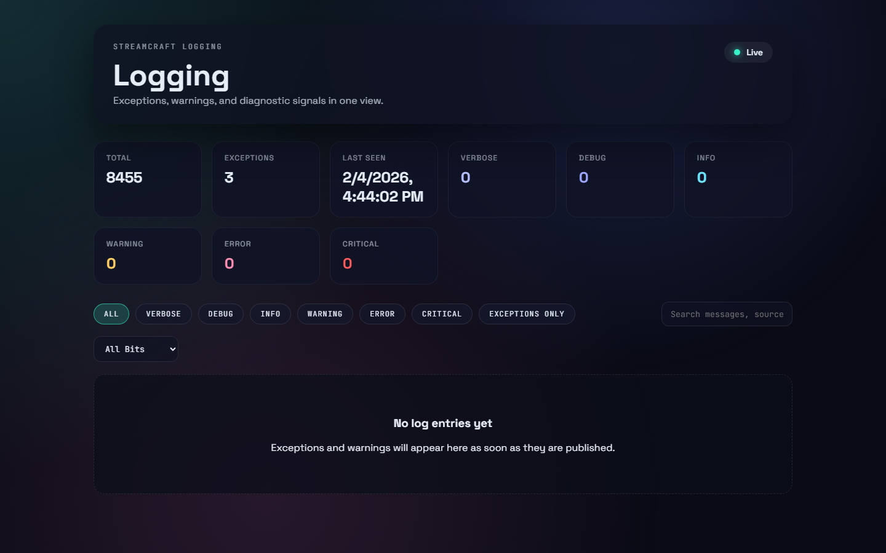
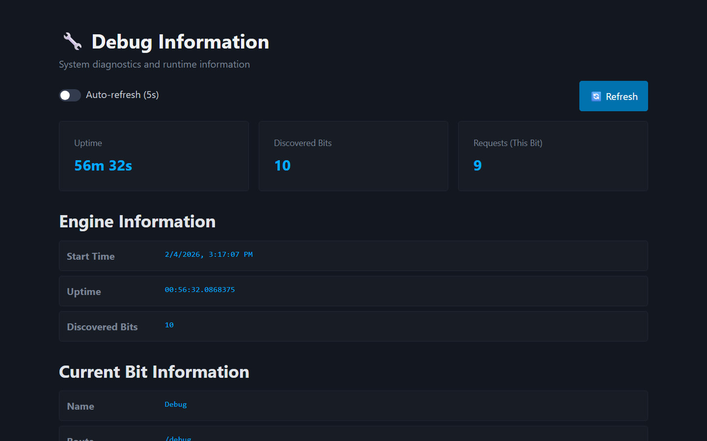
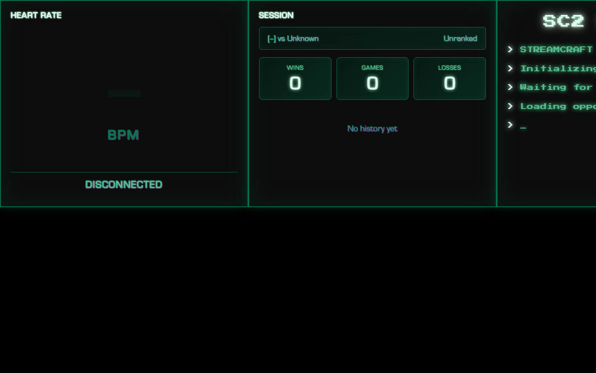
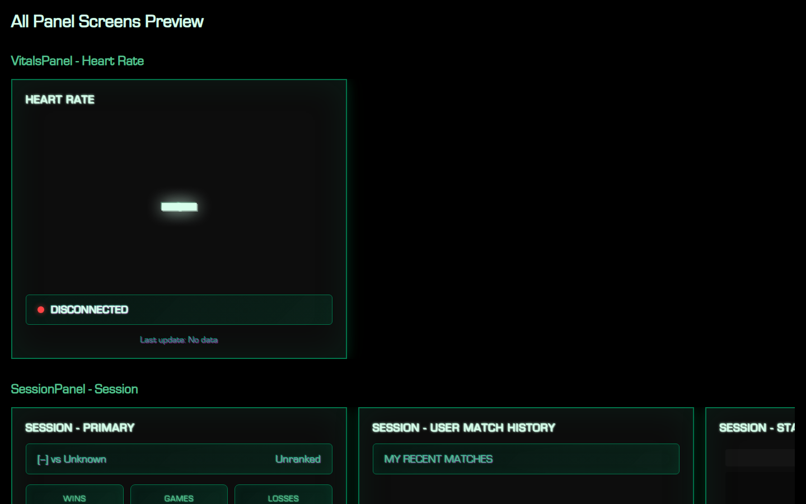

# StreamCraft

StreamCraft is a local-first overlay engine for streamers. It runs on your machine, exposes browser-source pages for OBS, and lets you build overlays visually with a plugin system called **Bits**.

> **Status:** Most bits are in WIP state and are subject to radical change.

> **Designer UI styling:** the CSS looks intentionally minimal/retro because it is a foundation layer that is dead-simple to modify.

## Quick start

### Prerequisites

- .NET 8 SDK
- Node.js + npm

### Run backend

```powershell
.\run.ps1
```

The backend host defaults to `http://localhost:5000`.

### Run frontend (Designer UI)

```powershell
.\run.ps1 -Mode watch
```

Vite will serve the Designer UI (default `http://localhost:5173`).

## How Bits work

Bits are the core feature modules. Each bit is a .NET project under `Bits/` with a `bit.json` and an entry assembly that implements `IStreamCraftBit`.

At runtime, the engine discovers all bit assemblies, registers their services, and maps their endpoints. Bits can provide:

- Data sources (for binding live data into overlays)
- UI forms (for custom dialogs / tooling)
- Media providers (images/video through `/localmedia/*`)
- Background services

### Bit structure (minimal)

```
Bits/MyBit/
  MyBit.csproj
  MyBitEntry.cs
  bit.json
```

`bit.json` registers your entry assembly:

```json
{
  "id": "MyBit",
  "entryAssembly": "MyBit.dll",
  "internal": true
}
```

`MyBitEntry.cs` implements the bit entry point:

```csharp
public sealed class MyBitEntry : StreamCraftBitBase
{
    public override void ConfigureServices(IServiceCollection services, BitContext context)
    {
        // register data sources, stores, background services
    }

    public override void MapEndpoints(IEndpointRouteBuilder endpoints, BitContext context)
    {
        // map HTTP endpoints
    }
}
```

## Core platform features

These live in `Core/` and can be used by any bit.

- **Data sources (`Core/DataSources`)**
  - `IDataSource` + category interfaces define catalogable sources.
  - `DataSourceCategoryResolver` derives category labels from interfaces/attributes.
  - `ApiResponseMetadata` captures response schemas for API-backed sources.

- **UI extensions (`Core/Ui/Extensions`)**
  - `DesignerUiExtensionRegistry` stores extension definitions (triggers + dialogs).
  - `UiForm` + `UiFormNode` provide a JSON UI schema for backend-defined forms.

- **Media cache + gateway (`Core/Media`)**
  - `Core/Media/Cache/MediaCacheStore` persists images/videos as blobs in DuckDB (keyed by provider + external id).
  - `Core/Media/Gateway/MediaGateway` exposes `/localmedia/*` endpoints and routes to providers (`IMediaProvider`).

- **Fonts (`Core/Media/Fonts`)**
  - Google Fonts catalog + file caching (DuckDB-backed).
  - Lazy file retrieval by family/variant via `/textstyles/fonts/file`.

- **Event/Trigger/Effect System (`Core/Events`)**
  - Bit-agnostic stream event framework for donations, chat, follows, etc.
  - `IEventProducer<TEvent>` + `ITrigger<TEvent>` + `IEffect<TEvent>` generic contracts.
  - `EventOrchestrator` coordinates event flow via MessageBus.
  - CRUD APIs at `/events/*` for managing triggers/effects.
  - EventPlayground bit provides manual emit + dev-mode simulation (random donation/chat).
  - See [Event/Trigger/Effect Framework](docs/architecture/event-trigger-effect-framework.md) for detailed docs.

- **Preview providers (`Core/Runtime/Preview`)**
  - `IDataSourceProvider` supplies live preview payloads for UI testing.

- **KeyVault (`Core/Security/KeyVault`)**
  - Encrypted secrets stored in DuckDB, with dev/test/live values.
  - UI/admin bit interacts with this store; other bits read via `IKeyVault`.

## Developing UI + overlays

The Designer UI lives in `Bits/Designer/ui`. It renders a Win98-styled editor and outputs overlay layouts.

- **Canvas items** are positioned elements (text, image, progress, etc.)
- **Data binding** attaches a data source + field path to an item
- **Preview** renders live data through the preview pipeline
- **Context bar** provides per‑tool editing (text, shapes, progress, binding, scheduling).
- **Scheduling** uses a stopwatch next to bindings; intervals sync via “Reset timers”.
- **Autosave** runs after 5s of inactivity and shows a blocking “AUTOSAVING …” overlay.
- **Dock layout** is stored locally (localStorage), not in autosave.

## Repo layout

- `App/` - application host
- `Core/` - shared platform services (data, UI extensions, media, key vault)
- `Bits/` - feature modules
- `Engine/` - runtime discovery + orchestration
- `Hosting/` - web host + boot
- `docs/` - product docs and mockups

## Notes

This is a fast-moving project and still in heavy refactoring. Expect breaking changes.

## Screenshots














### Generating screenshots (local)

A small Playwright helper lives in `docs/screenshoits/UrlShot` (ignored by git). It writes PNGs to `docs/screenshots/`.

```powershell
# 1) Start backend + frontend
.\run.ps1 -Mode watch

# 2) Generate screenshots
cd docs\screenshoits\UrlShot
# First run creates shots.json in this folder
# Edit shots.json as needed

dotnet run -- --config shots.json
```

## Contact

- Email: ppotepa+streamcraft@hotmail.com
- Telegram: @protectmyballz
- Video demo: https://www.youtube.com/watch?v=C7Ebfe9p_U0
